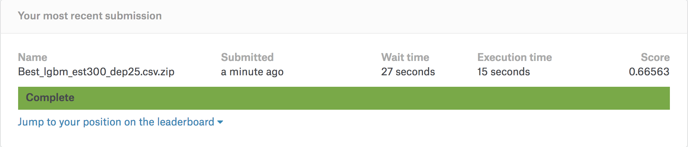
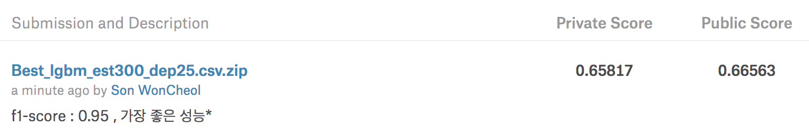
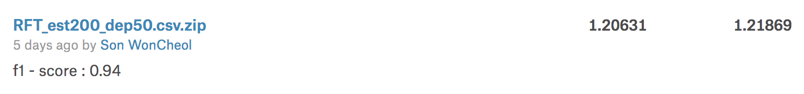
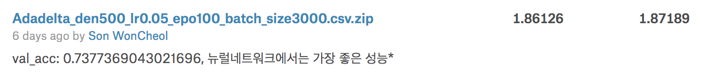

# Classification-Analysis-Project
```Kaggle Data : Walmart Recruiting를 사용한 Trip Type 분류분석 프로젝트```
</br>

## Desciption


</br>

## Result
[ Best Score ]
</br>

</br>
- Private Score (70% of the test data) : 0.65817
- Public Score (30% of the test data) : 0.66563
- Rank : 181 / 1047 (17.28%) 
</br>

[ Other Trials ]
</br>





</br>

## Source
\*source : [Walmart Recruiting: Trip Type Classification](https://www.kaggle.com/c/walmart-recruiting-trip-type-classification)